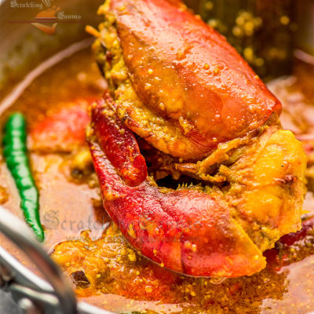
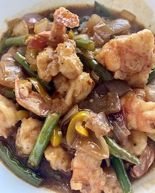

Around a year ago, this project was one of the first ones ported to the `v1` version of GatsbyJS.

New features are:

- NetlifyCMS support
- Complete optimization of all image assets via `gatsby-image` for faster loading times
- New date formatting options
- Netlify build configuration to make deploys easier
- Less restrictive URL options
- Bug fixes related to dates and sorting

Full feature list:

- Blazing fast loading times thanks to pre-rendered HTML and automatic chunk loading of JS files
- [React-MD](https://github.com/mlaursen/react-md) for Material design
  - Integrated FontAwesome support
  - Integrated Material Icons support
- SASS/SCSS styling
- [NetlifyCMS](https://www.netlifycms.org/docs/intro/) support for creating/editing posts via admin panel
- Separate components for everything
- High configurability:
  - User information
  - User social profiles
  - Copyright information
  - More!
- Author segment
  - Name
  - Location
  - Description
  - Links
  - Follow Me button
- Posts in Markdown
  - Code syntax highlighting
  - Embedded YouTube videos
  - Embedded Tweets
- Tags
  - Seprate page for posts under each tag
- Categories
  - Separate page for posts under each category
- Suggested posts segment
- Disqus support
  - Notifications about new disqus comments
- Responsive design
  - On mobile, Disqus is loaded only after expanding comments for better performance
- Social features
  - Twitter tweet button
  - Facebook share/share count
  - Reddit share/share count
  - Google+ share button
  - LinkedIn share button
  - Telegram share button
- SEO
  - Sitemap generation
  - robots.txt
  - General description tags
  - Schema.org JSONLD (Google Rich Snippets)
  - OpenGraph Tags (Facebook/Google+/Pinterest)
  - Twitter Tags (Twitter Cards)
- RSS feeds
- Loading progress for slow networks
- Offline support
- Web App Manifest support
- Automatic image transformation and size optimization
- Netlify deploy configuration
- Google Analytics support
- Development tools
  - ESLint for linting
  - Prettier for code style
  - Remark-Lint for linting Markdown
  - write-good for linting English prose
  - gh-pages for deploying to GitHub pages
  - CodeClimate configuration file and badge

NOTE: Take a look at [gatsby-advanced-starter](https://github.com/Vagr9K/gatsby-advanced-starter) if you prefer building UI from scratch and/or only interested in fundamental features.
 

More information is available on [GitHub repository page](https://github.com/Vagr9K/gatsby-material-starter).

 |                             
:----:| ------------------------------------------------
Step1    | Content from cell 2 and long description and bit bigger then even bigger then a bit and a more some more Content from cell 2 and long description and bit bigger then even bigger then a bit and a more some more Content from cell 2 and long description and bit bigger then even bigger then a bit and a more some more Content from cell 2 and long description and bit bigger then even bigger then a bit and a more some more Content from cell 2 and long description and bit bigger then even bigger then a bit and a more some more
Step2           | Content in the second column is short though

<table>
  <col  width="20%">
  <col  width="80%">
  <tr>
    <td >   </td>
    <td>Content in the second column is short though</td>
  </tr>
  <tr>
    <td> 
    <td>Content in the second column is short though</td>
  </tr>
  <tr>
      <td> 
      <td>Content in the second column is short though</td>
    </tr>
</table>